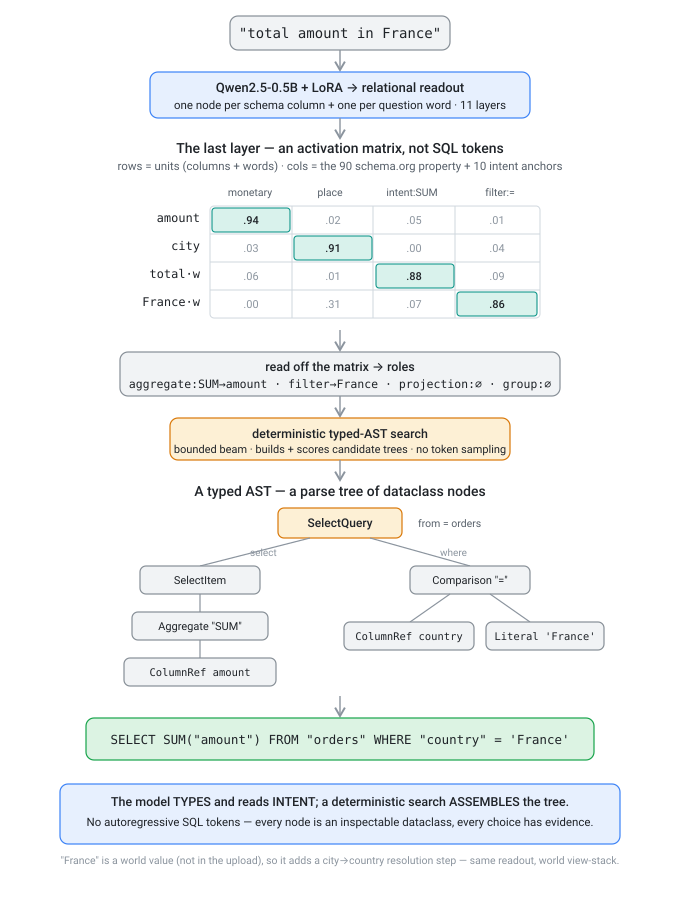

# From prompt to SQL — how PreReasoner reads a question

*A walkthrough for new developers. If you remember one thing: PreReasoner does **not** generate SQL as a
stream of text tokens. The transformer produces a **typed readout**, and a deterministic search **assembles a
parse tree** from it. That is why every answer is inspectable and byte-for-byte reproducible.*



We trace the prompt **`"total amount in France"`** through the stack. (It happens to be a *world* query — more
on that at the end — but the core own-data machinery is the same for every question.)

---

## Stage 1 — the prompt becomes a `units × anchors` matrix

There is **no autoregressive decoder**. The encoder is asked one thing: *what does each part of the question,
and each column of the data, mean?*

[`engine/encoder_overlay.py:_question_readout`](../engine/encoder_overlay.py) builds a small graph of **units**:

- one node per **schema column name** — `city`, `amount`, …
- one node per **question word** — `total`, `amount`, `in`, `France`

Each unit's text is embedded by **Qwen2.5-0.5B + a LoRA adapter** (896-dim), then the trained *relational
readout* runs for **11 layers** (`cfg = {in_dim: 896, H: 384, nc: 90, n_edge: 10, layers: 10}`; `nL = layers + 1`).
We keep the **last layer**:

```python
final = self._layers(units, x)[-1]     # final[unit_index] -> a vector over the anchors
```

`final` is a **matrix**, not a token sequence. Each row `final[unit]` is a ~100-length vector over the model's
**anchors**: **90 schema.org-property dims + 10 intent dims**, each squashed to `[0, 1]`. A row is a *fingerprint
of meaning*:

| unit | reads as | which anchors light up |
|---|---|---|
| column `amount` | a **type** | `monetaryAmount` / measure ≈ .94 |
| column `city` | a **type** | `address` / place ≈ .91 |
| word `total` | an **intent** | `intent_agg_sum` ≈ .88 |
| word `France` | an **intent** | `filter` (equality) ≈ .86 |

The *column* fingerprints are exactly what the `/api/dimension` endpoint returns. The *word* fingerprints hold
the intents: [`read_op_model`](../engine/encoder_overlay.py) reads the aggregate operator straight off the verb
(`intent_agg_sum` fires on "total"/"sell", `intent_agg_count` on "how many") — **from the model, not a keyword
list**.

## Stage 2 — the matrix becomes role signals

[`engine/tables.py:ast_semantic_signals`](../engine/tables.py) splits the question into **role phrases**
(projection / aggregate / filter / group / order — see `semantic_role_phrases` in
[`engine/sql_rank.py`](../engine/sql_rank.py)), re-encodes each phrase in the same 384-d metric space, and
**cosine-matches** it against every column's vector. The result is a structured
[`SemanticSignals`](../engine/sql_rank.py) record — *which column plays which role, and how strongly*:

```
aggregate: SUM -> amount      filter -> France      projection: ∅      group: ∅
```

## Stage 3 — a deterministic search assembles a typed AST

This is the step people expect an LLM to do by "writing SQL". PreReasoner instead **searches over typed trees**.
[`engine/sql_search.py:SQLSearcher.search`](../engine/sql_search.py) runs a bounded beam search that *constructs*
candidate queries out of the frozen dataclass nodes in [`engine/sql_ast.py`](../engine/sql_ast.py):

```
SelectQuery(
  select   = ( SelectItem( Aggregate("SUM", ColumnRef("orders","amount")) ), ),
  from_table = "orders",
  where    = Comparison( ColumnRef("orders","country"), "=", Literal("France") ),
)
```

The node types are a real grammar: `SelectQuery`, `SelectItem`, `Aggregate`, `ColumnRef`, `Comparison`,
`BooleanExpr`, `OrderTerm`, `Join`, `ScalarSubquery`, `InPredicate`, … Each candidate is wrapped as a
[`ScoredQuery(query, score, evidence, features)`](../engine/sql_candidate.py) — the `evidence` tuple is the
human-readable trace (`"extrema:projection"`, `"aggregate:SUM(...)"`, ...). Serving takes **`candidates[0]`**
([`engine/tables.py:_serve_ast`](../engine/tables.py)); there is **no trained proposer and no learned ranker** —
the ranking is hand-written and inspectable.

## Stage 4 — render the tree to a SQL string

Only now does a string appear: the winning `SelectQuery` is rendered to
`SELECT SUM("amount") FROM "orders" WHERE "country" = 'France'`, guarded (SELECT-only), and executed.

---

## Why this shape (the payoff)

Because the model only **types + reads intent** and a deterministic planner **assembles the tree**:

- **Interpretable** — you can see the per-column typing (the matrix) *and* the per-node `evidence` for every
  choice. Nothing is a black-box string.
- **Deterministic** — the same input yields byte-identical SQL. This is enforced by a cross-process repeatability
  test in [`tests/test_routing.py`](../tests/test_routing.py).
- **Valid by construction** — every candidate is a well-typed AST that passes constraint checks before it can
  win, so the planner cannot emit malformed SQL.

Contrast with a GPT-style pipeline, which decodes SQL **left-to-right as tokens** and can hallucinate columns or
syntax. PreReasoner trades some raw coverage (it's a 0.5B model) for an auditable, reproducible path.

## The one caveat in this example: world queries

`"total amount in France"` is a **world** query — `France` is *not* a value in the uploaded cities, so it can
only be reached by resolving `city → country` against the world knowledge base. The shared router
([`engine/routing.py:route`](../engine/routing.py)) detects a **necessary world dependency** and hands the query
to the `ComposeEngine`, which builds a **view-stack** (`world_join → world_filter → group_agg`) instead of a
single `SelectQuery`. The readout underneath is identical, and the view stack is still a *typed tree/DAG of
nodes* — just hosted as a world composite rather than the own-data planner. For a purely own-data prompt like
`"how many customers in Paris"`, you get the single `SelectQuery` exactly as drawn above
(`SELECT COUNT(*) … WHERE city = 'Paris'`).

See [`docs/ARCHITECTURE.md`](ARCHITECTURE.md) for how routing decides own-data vs. world, and
[`docs/SQL_AST.md`](SQL_AST.md) for the planner's search phases in depth.

---

## Where to look in the code

| Concern | File · symbol |
|---|---|
| Build the unit graph + run the readout | `engine/encoder_overlay.py` · `_question_readout` |
| Operator/intent off the question verb | `engine/encoder_overlay.py` · `read_op_model` |
| Per-column typing (the anchor readout) | `engine/dimension.py` · `analyze` (the `/api/dimension` view) |
| Role phrases → per-column role signals | `engine/tables.py` · `ast_semantic_signals`; `engine/sql_rank.py` · `SemanticSignals`, `semantic_role_phrases` |
| The typed AST node grammar | `engine/sql_ast.py` · `SelectQuery`, `SelectItem`, `Aggregate`, `Comparison`, … |
| The search that assembles the tree | `engine/sql_search.py` · `SQLSearcher.search` |
| One scored candidate | `engine/sql_candidate.py` · `ScoredQuery` |
| Serving entry point (top-1, render, execute) | `engine/tables.py` · `search_ast`, `_serve_ast` |
| Own-data vs. world routing | `engine/routing.py` · `route`, `compose_owns` |
