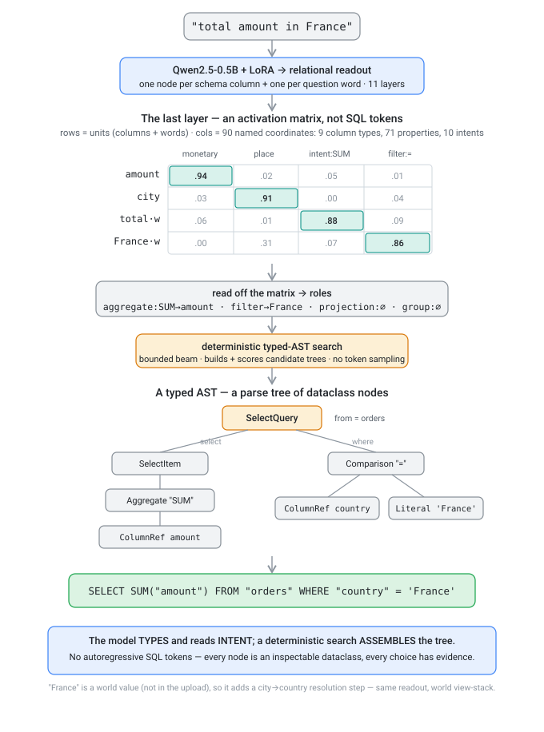

# From question to SQL

This walkthrough follows one request through Prereasoner. The important boundary is simple:
every query that runs is a typed AST the engine validated and rendered itself. The encoder
contributes evidence: typed signals about the question and the tables. A deterministic search builds
candidate queries from those signals, and the engine serves the best-ranked one that runs and fits
the data. No local model writes SQL. The one exception needs an operator switch; it is described,
with how its answers are labelled, [after the walkthrough](#when-the-search-finds-nothing-the-labelled-gemini-fallback).



We trace **`"total amount in France"`** through the stack. This happens to need public world data,
but the own-data planning steps are the same for an ordinary table question.

This world-data example follows the SQL serving path. Grounded world bindings and supported own-data winners also lower into
one shared plan that emits a SQL view stack and readable ORM/Python stages. The backend is selected
by request context, after planning. See [DETERMINISTIC_EMITTERS.md](DETERMINISTIC_EMITTERS.md) for
that path and its limits; the world example here does not demonstrate Python world execution.

---

## Stage 1 - the question becomes typed signals

The encoder is asked one thing: what does each part of the question and each column of the data mean?

[`engine/encoder_overlay.py:_question_readout`](../engine/encoder_overlay.py) builds a small graph of **units**:

- one node per **schema column name** — `city`, `amount`, …
- one node per **question word** — `total`, `amount`, `in`, `France`

Each unit's text is embedded by **Qwen2.5-0.5B + a LoRA adapter** (896-dim), then the trained *relational
readout* runs for **11 layers** (`cfg = {in_dim: 896, H: 384, nc: 90, n_edge: 10, layers: 10}`; `nL = layers + 1`).
We keep the **last layer**:

```python
final = self._layers(units, x)[-1]     # final[unit_index] -> a vector over the anchors
```

`final` is a **matrix**, not a token sequence. Each row `final[unit]` is a 90-length vector over the model's
named **anchors**: 9 column types, 71 property names, and 10 query intents, each squashed to `[0, 1]`. A row
is a *fingerprint of meaning* (values below are illustrative):

| unit | reads as | which anchors light up |
|---|---|---|
| column `amount` | a **type** | `is_num` (a numeric measure) ≈ .94 |
| column `city` | a **type** | `address` / place ≈ .91 |
| word `total` | an **intent** | `intent_agg_sum` ≈ .88 |
| word `France` | an **intent** | `intent_filter_eq` (equality filter) ≈ .86 |

The *column* fingerprints are exactly what the `/api/dimension` endpoint returns. The *word* fingerprints hold
the intents: [`read_op_model`](../engine/encoder_overlay.py) reads the aggregate operator straight off the verb
(`intent_agg_sum` fires on "total"/"sell", `intent_agg_count` on "how many") — **from the model, not a keyword
list**.

## Stage 2 — the matrix becomes role signals

[`engine/tables.py:ast_semantic_signals`](../engine/tables.py) splits the question into **role phrases**
(projection / aggregate / filter / group / order — see `semantic_role_phrases` in
[`engine/sql_rank.py`](../engine/sql_rank.py)), re-encodes each phrase in the same 384-d metric space, and
**cosine-matches** it against every column's vector. The result is a structured
[`SemanticSignals`](../engine/sql_rank.py) record — *which column plays which role, and how strongly*:

```
aggregate: SUM -> amount      filter -> France      projection: ∅      group: ∅
```

## Stage 3 — a deterministic search assembles a typed AST

This is the step people expect an LLM to do by "writing SQL". Prereasoner instead **searches over typed trees**.
[`engine/sql_search.py:SQLSearcher.search`](../engine/sql_search.py) runs a bounded beam search that *constructs*
candidate queries out of the frozen dataclass nodes in [`engine/sql_ast.py`](../engine/sql_ast.py):

```
SelectQuery(
  select   = ( SelectItem( Aggregate("SUM", ColumnRef("orders","amount")) ), ),
  from_table = "orders",
  where    = Comparison( ColumnRef("orders","country"), "=", Literal("France") ),
)
```

The node types are a real grammar: `SelectQuery`, `SelectItem`, `Aggregate`, `ColumnRef`, `Comparison`,
`BooleanExpr`, `OrderTerm`, `Join`, `ScalarSubquery`, `InPredicate`, `DatePart` (the month of a date column,
for "signed in August", or its year-month, for "total amount by month"), … Each candidate is wrapped as a
[`ScoredQuery(query, score, evidence, features)`](../engine/sql_candidate.py) — the `evidence` tuple is the
human-readable trace (`"extrema:projection"`, `"aggregate:SUM(...)"`, ...). The search orders its pool with
hand-written, named ranking rules (`CandidateRanker` in [`engine/sql_rank.py`](../engine/sql_rank.py)) and
keeps the 25 best-ranked candidates (`SEARCH_CANDIDATES`).

## Stage 4 — run each candidate and check it against the data

[`engine/tables.py:select_query`](../engine/tables.py) runs every candidate on an in-memory copy of the
tables, under the SELECT guard and a fixed budget of SQLite VM steps. A query that fails is out. So is one
that compares a text column with a literal the column never holds while another column does
(`customer_name = 'Lyon'` when `Lyon` is in the city column), and one that joins two columns the foreign
keys keep apart ([`engine/sql_grounding.py`](../engine/sql_grounding.py)). The candidates that are
left are *eligible*. Running is a validity check, not proof of meaning: an eligible query can still answer
a different question.

## Stage 5 — serve the best-ranked eligible candidate

The served query is the best-ranked eligible candidate. Nothing rescores the pool. Preferences can pick
a later eligible candidate instead: a date the question names keeps the choice to the candidates that
realize it; a candidate whose SUM or AVG reads only rows its joins repeat, such as a report's Total Amount
summed once per subscription the report row matched, is served only when every eligible candidate does
([`engine/sql_grounding.py`](../engine/sql_grounding.py)); a calculation intent takes the best-ranked
candidate that realizes it (`engine/calculations`); and a money noun that names its table ("what's the
sales in London") takes the best-ranked candidate that aggregates a money column. The response's
`planner.selection` records the pool counts (how many ran, how many were grounded), the served member's
rank and search score, and `served_by: search`. The winner's own `evidence` and `features` show which
rules put it first.

## Stage 6 — render the tree to a SQL string

The winning AST is rendered to `SELECT SUM("amount") FROM "orders" WHERE "country" = 'France'`, guarded
(SELECT-only), and executed. A served top-1 ranking (`ORDER BY ... LIMIT 1`) is rendered with
`RANK() OVER` so it keeps every row tied with the first (`sql_ast.keep_ties`).

---

## Why this shape (the payoff)

Because the model only **reads signals**, and the engine **builds, checks and renders the tree**:

- **Interpretable** — you can see the per-column typing (the matrix), the per-node `evidence` for every
  candidate, the named ranking features that put the winner first, and the selection record.
- **Deterministic** — with the fallback below off, the same input yields byte-identical SQL. This is enforced
  by a cross-process repeatability test in [`tests/test_routing.py`](../tests/test_routing.py).
- **Valid by construction** — every candidate is a well-typed AST that passes constraint checks before it can
  win, so the planner cannot emit malformed SQL.

Contrast with a pipeline that executes a model's SQL directly: a column the model invents, a clause it drops,
or a join it guesses goes straight to the database. Here no local model writes SQL. The one model-written query
the system can use, described next, still has to import into the typed grammar and pass Stages 4 to 6.

## When the search finds nothing: the labelled Gemini fallback

This section describes an optional wording aid. It runs when Stage 4 leaves no eligible candidate or
the selected plan leaves request wording unresolved, and the operator enabled Gemini
(`EXTERNAL_LLM_ENABLED`, [`engine/llm.py`](../engine/llm.py)).
The switch defaults to off, and with it off nothing below happens; the guided Community deployment
turns it on together with chat. [`engine/question_rewrite.py`](../engine/question_rewrite.py) makes one
bounded rewrite request:

1. **Gemini rewords the question once**, in the tables' own words. Stages 3 to 6 run again on the
   rewording, so the search still builds the SQL. The answer says the search read Gemini's rewording,
   and shows it.
The deterministic search then builds SQL from the rewrite; there is no SQL proposal step. Before the
rewrite is searched, the engine checks that recognized source values, quoted text, and numbers from
the user question remain. Gemini sees table and column names, inferred types, and foreign keys from
[`engine/sql_prompt.py`](../engine/sql_prompt.py), and the question with the values it states quoted. It
receives no other cell value, no conversation history, and no rows, and it never writes SQL or a number.
`served_by` is `gemini-rewrite`, and the response's `fallback` record holds the rewording. Rewrites are not
cached. See
[`docs/ARCHITECTURE.md`](ARCHITECTURE.md#labelled-gemini-fallback) for the checks that apply to each case.

## The one caveat in this example: world queries

`"total amount in France"` is a **world** query — `France` is *not* a value in the uploaded cities, so it can
only be reached by resolving `city → country` against the Wikidata-backed entity store, with
Schema.org-named typing evidence. The shared router
([`engine/routing.py:route`](../engine/routing.py)) detects a **necessary world dependency** and lets the
`ComposeEngine` build a **view-stack** (`world_join → world_filter → group_agg`) instead of a single
`SelectQuery`. The selected world bindings then lower into the same deterministic plan used by SQL and Python.
For a purely own-data prompt like `"how many customers in Paris"`, you get the single `SelectQuery` exactly as
drawn above (`SELECT COUNT(*) … WHERE city = 'Paris'`). For an analytical own-data prompt such as a top-N or
share, ComposeEngine may supply a multi-view binding; explicit `use=py` or `use=both` lowers that binding through
the same Python/SQL emitter pair rather than accepting an opaque SQLite answer.

See [`docs/ARCHITECTURE.md`](ARCHITECTURE.md) for how routing decides own-data vs. world, and
[`docs/SQL_AST.md`](SQL_AST.md) for the planner's search phases in depth.

---

## Where to look in the code

| Concern | File · symbol |
|---|---|
| Build the unit graph + run the readout | `engine/encoder_overlay.py` · `_question_readout` |
| Operator/intent off the question verb | `engine/encoder_overlay.py` · `read_op_model` |
| Per-column typing (the anchor readout) | `engine/dimension.py` · `analyze` (the `/api/dimension` view) |
| Role phrases → per-column role signals | `engine/tables.py` · `ast_semantic_signals`; `engine/sql_rank.py` · `SemanticSignals`, `semantic_role_phrases` |
| The typed AST node grammar | `engine/sql_ast.py` · `SelectQuery`, `SelectItem`, `Aggregate`, `Comparison`, … |
| The search that assembles the tree | `engine/sql_search.py` · `SQLSearcher.search` |
| One scored candidate | `engine/sql_candidate.py` · `ScoredQuery` |
| Run and ground the candidates | `engine/tables.py` · `select_query`, `_executable`; `engine/sql_grounding.py` · `grounded_members` |
| Serve the best-ranked eligible candidate | `engine/sql_rank.py` · `select_ranked_candidate`, `PoolSelection` |
| Labelled Gemini rewrite | `engine/question_rewrite.py` · `QuestionRewriter.rewrite`; `engine/sql_prompt.py` · rewrite prompt and schema |
| Offline SQL → typed AST fixtures | `regress/sql_import.py` · `import_sql`; never used by serving |
| Serving entry point (select, render, execute) | `engine/tables.py` · `select_query`, `_serve_ast` |
| Own-data vs. world routing | `engine/routing.py` · `route`, `compose_owns` |
